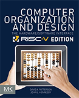
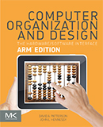
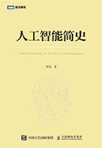
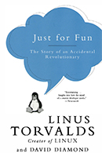
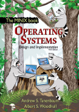
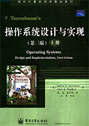
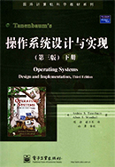
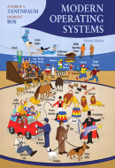
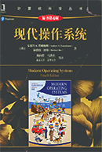

[Computer Organization and Design - The Hardware Software Interface RISC-V Edition](./books/Computer-Organization-and-Design-The-Hardware-Software-Interface-RISC-V-Edition.pdf)

By David A Patterson, John L. Hennessy

---

[Computer Organization and Design - The Hardware Software Interface ARM Edition](./books/Computer-Organization-and-Design-The-Hardware-Software-Interface-ARM-Edition.pdf)

By David A Patterson, John L. Hennessy

---

[人工智能简史](./books/人工智能简史.pdf)

尼克 著

---

[Just for Fun: The Story of an Accidental Revolutionary](./books/Just-for-fun-The-Story-of-an-Accidental-Revolutionary.pdf)

By Linus Torvalds, David Diamond

---

  

[Operating Systems Design and Implementation 3rd Edition](./books/Operating-Systems-Design-and-Implementation-3rd-Edition.pdf)

[操作系统设计与实现 第3版 上册](./books/操作系统设计与实现第3版上册.pdf)

[操作系统设计与实现 第3版 下册](./books/操作系统设计与实现第3版下册.pdf)

By Andrew S Tanenbaum, Albert S Woodhull

陈渝 谌卫军 译

---

 

[Modern Operating Systems 4th Edition](./books/Modern-Operating-Systems-4th-Edition.pdf)

[现代操作系统 第4版](./books/现代操作系统第4版.pdf)

By Andrew S. Tanenbaum, Herbert Bos

陈向群 马洪兵 等译